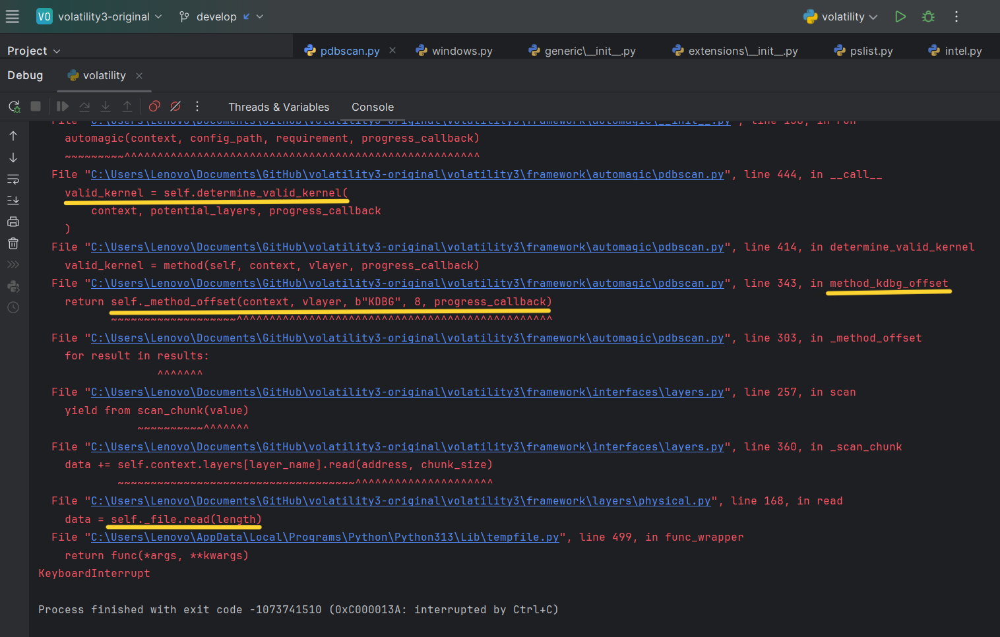
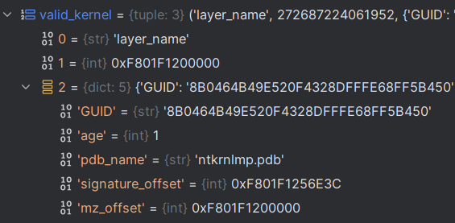
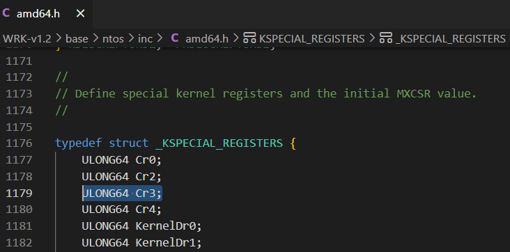
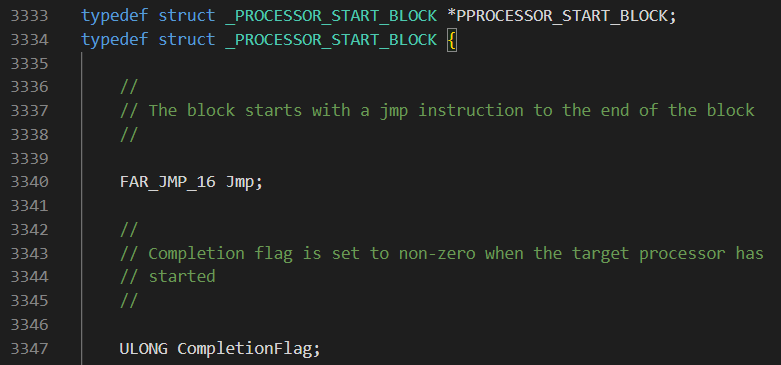
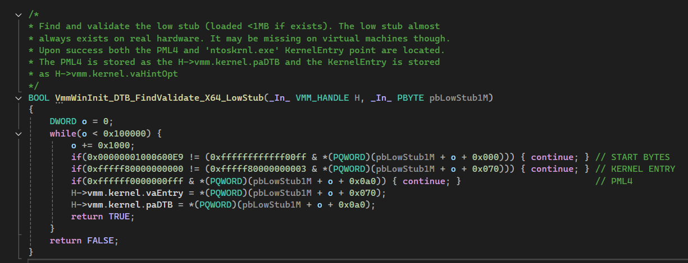

## Quick TL;DR
By using [PROCESSOR_START_BLOCK](#what-is-processor_start_block) instead of 
[KDBG](#what-is-kdbg) to locate the Windows kernel base, I reduced Volatility’s 
analysis time from ~15 seconds to about 1 second on a 32GB RAM sample.
[See the merged code in Volatility][2].  

*Note*: This method works only on x64 systems with no virtualization. Otherwise, Volatility gracefully falls back to KDBG scanning.

---

## Introduction
Volatility and Memprocfs are both popular memory forensics tools, but they work 
differently under the hood. Volatility traditionally scans for a structure 
called [KDBG](#what-is-kdbg) (Kernel Debugger Block), which can be time-consuming 
for large memory captures. Meanwhile, Memprocfs uses the undocumented 
[PROCESSOR_START_BLOCK](#what-is-processor_start_block) approach, which is 
significantly faster on x64 systems with no virtualization.

### My Test Results
1. *Volatility3 (Baseline)*  
   - First run (downloading ntoskrnl symbols): ~51 seconds  
   - Second run: ~15 seconds  

2. *Memprocfs*  
   - Immediate parsing (~1 second)

3. *Modified Volatility3* (incorporating the PROCESSOR_START_BLOCK approach)  
   - First run (symbol download): ~32 seconds  
   - Second run: ~1 second

These tests underscore how crucial it is to detect the kernel base efficiently, 
especially during time-sensitive Incident Response tasks.

---

### What is KDBG?
KDBG is an internal Windows kernel structure (often recognized by the signature 
b'KDBG' in KDDEBUGGER_DATA64->OwnerTag). It lists running processes, loaded kernel modules, and Windows version info. Volatility normally scans the entire 
memory image looking for this signature to find the kernel base, which can slow down analysis for large 
RAM captures. For more on KDBG, see [this][0] or [this][1].

---

### What is PROCESSOR_START_BLOCK?
PROCESSOR_START_BLOCK is an undocumented structure stored in the 
[Low Stub](#what-is-the-low-stub) (a tiny 16-bit code segment in 64-bit Windows). Among its fields is 
[Cr3][9], which stores the base address of the page tables, which are essential for virtual-to-physical address translation in Windows. By scanning the first 1MB of physical memory 
for this structure, we can quickly find the kernel base without a full memory scan.

---


## Technical overview
**During the debug process, I noticed that the _```"KDBG"```_ scan takes most of the time.**
How do I know that? Let's start the Reverse Engineering process.
### Volatility3 Reverse Engineering
To begin analyzing the memory, we need to get it first. What I prefer running [```Memprocfs```][4] using the command line ```memprocfs -device pmem``` which mounts a new Virtual File System as drive ```M:```, having the RAM file in ```M:\memory.pmem```. 
This lets me compare **live** memory parsing done by Memprocfs and by Volatility.
When I tested ```Volatility3``` by running: ```python vol.py -f M:\memory.pmem windows.pslist.PsList``` I saw numerous debug prints, and the scan took quite a while. Interrupting the process with ```Ctrl+C``` showed the functions call stack, "stuck" in the following function call: ```data = self._file.read(length)```. 





Following the call stack, ```self.determine_valid_kernel``` eventually calls ```method_kdbg_offset(...)``` - the KDBG-based scan.

```python
    valid_kernel: Optional[ValidKernelType] = None
        for virtual_layer_name in potential_layers:
            vlayer = context.layers.get(virtual_layer_name, None)
            if isinstance(vlayer, layers.intel.Intel):
                for method in self.methods:
                    valid_kernel = method(self, context, vlayer, progress_callback)
                    if valid_kernel:
                        break
        if not valid_kernel:
            vollog.info("No suitable kernels found during pdbscan")
        return valid_kernel
    ...
    ...
    ...
    # List of methods to be run, in order, to determine the valid kernels
    methods = [
        method_kdbg_offset,
        method_module_offset,
        method_fixed_mapping,
        method_slow_scan,
    ]
```

If we implement our own method (e.g., ```method_low_stub_offset```) before ```method_kdbg_offset``` in that list, we can skip the slower KDBG scan on supported systems.

But wait, what should ```"valid_kernel"``` structure contain?

#### Volatility scan implementation
If we continue to analyze the code stack and the code statically we'll see that ```determine_valid_kernel``` calls to ```method_kdbg_offset``` which calls to ```_method_offset(context, vlayer, b'KDBG', 8, progress_callback)``` that essentialy:
1. Scans for ```b'KDBG'``` bytes (```_KDDEBUGGER_DATA64->OwnerTag```) - a process which takes a lot of time.
2. Determines the kernel base from the structure by reading the field ```_KDDEBUGGER_DATA64->KernBase```.
3. Calls to ```valid_kernel = self.check_kernel_offset(context, vlayer, address, progress_callback)``` where ```address``` is the previously kernel base.

In the snippet below you can see the contents of the ```valid_kernel``` variable after it's populated.
In a nutshell it includes:
1. the kernel base offset in virtual memory. 
2. The name of the pdb file ```ntkrnlmp.pdb``` for the specific kernel version ([here's pdb explanation](#what-is-pdb)).
3. The offset of the aformentioned name.
4. The GUID that's used to download the pdb file.



---

#### What is pdb???

A PDB (Program Database) file contains debugging symbols for Windows executables (like ntoskrnl) that describe offsets of classes, functions, fields, global variables, etc. Volatility uses these symbols to properly interpret kernel data structures. Each PDB has a GUID (Globally Unique Identifier) that ensures you’re downloading the exact symbol file corresponding to that specific kernel build—avoiding mismatches that could break analysis. [For more information][12].

---


### Memprocfs Reverse Engineering
Before a deep dive into Memprocfs we must know some theory.
### What is the Low Stub?
Memprocfs relies on "the most undocumented structure" that Alex Ionescu ([video][5]; min 43, [slides][6]; slides-46-49) says he's ever seen - the ```Low Stub```. 
The ```Low Stub``` is a tiny little piece of 16 bit code that still lives in 64 bit Windows used in two cases:
1. Booting processors from 16-bit Real Mode -> 32-bit Protected Mode -> 64-bit Long Mode.
2. Waking from sleep (which also starts in Real Mode).

Normally, the Low Stub is at physical address 0x1000. On some systems where "Discard Low Memory" is disabled in BIOS, it may appear at 0x2000, 0x3000, etc. Inside the Low Stub is ```PROCESSOR_START_BLOCK```, whose Cr3 fields references the system's page tables.

* For more information about the structures follow [this link to Github][7].




#### Memprocfs scan implementation
Memprocfs’s algorithm for locating the kernel base and enumerating processes is:
1. Iterate the first 1MB of physical memory (starting from 0x1000).
2. Identify PROCESSOR_START_BLOCK by specific signatures and fields.
3. Read the _Cr3_ (register pointing at the page tables) at offset 0xa0.
4. Read the “kernel_hint” at offset 0x70, then search a 32MB range for the actual ntoskrnl PE.
5. Once found, retrieve ```PsInitialSystemProcess``` exported functionn.
6. This exported function holds a pointer to the first [```_EPROCESS```][10] object, marking the “system process.”
7. Iterate the linked list of _EPROCESS structures to discover all processes.

---

#### What is _EPROCESS?

_EPROCESS is the Windows Executive Process data structure, containing key information about each process (e.g., process ID, handle table, memory layout, etc.). Memory forensics tools like Memprocfs or Volatility read these structures to list running processes and extract further process-specific data.

---

Below is a snippet from Memprocfs showing how it scans the low 1MB:



### Implementing ```method_low_stub_offset```
By replicating Memprocfs’s approach—searching the Low Stub first—we can avoid scanning the entire RAM for KDBG. This is especially beneficial on x64 systems without virtualization. For x86 or virtualized systems, Volatility falls back to the original KDBG logic automatically.
During the scan a few guard checks are implemented, verifying signatures and offsets. Before implementing the checks I've replicated the structures described in [this documentation of ```_PROCESSOR_START_BLOCK```][7] and wrote the following code that prints the offset of the given field within the structure:
```c
void print_diff(ULONG64 field_address, ULONG64 base_address) {
    printf("%d:%x\n", field_address - base_address, field_address - base_address);
}
```
I've put all the constant offsets and signatures well documented [here][8].
You can see the implementation of ```method_low_stub_offset``` and the explanation about the guard checks in the comments [here][11].
The last check is not explained there. ```PROCESSOR_START_BLOCK->LmTarget & 0x3``` should be 0 - to discard addresses that aren't aligned on a boundary of 4 bytes that valid kernel code typically use.

## Closing Thoughts
Hope you enjoyed reading this as much as I enjoyed implementing it and the community will benefit from this contribution.
Special thanks to the creators and maintainers of the Volatility project and to Ulf Frisk, the creator of Memprocfs.\
Always ask yourself how you can make things run better and be curious how things work, that's how I learned a lot from this work.\
If you have any questions feel free to reach me at ```danieldavidov555@proton.me```.

[0]: <https://alpbatursahin.medium.com/investigating-memory-forensic-processes-dlls-consoles-process-memory-and-networking-7277689a09b7#:~:text=The%20KDBG%20is%20a%20structure,processes%20and%20loaded%20kernel%20modules.>
[1]: <https://scudette.blogspot.com/2012/11/finding-kernel-debugger-block.html>
[2]: <https://github.com/volatilityfoundation/volatility3/pull/1566>
[3]: <https://github.com/Danking555/Rampy>
[4]: <https://github.com/ufrisk/MemProcFS>
[5]: <https://www.youtube.com/watch?v=_ShCSth6dWM>
[6]: <http://publications.alex-ionescu.com/Recon/ReconBru%202017%20-%20Getting%20Physical%20with%20USB%20Type-C,%20Windows%2010%20RAM%20Forensics%20and%20UEFI%20Attacks.pdf>
[7]: <https://github.com/mic101/windows/blob/master/WRK-v1.2/base/ntos/inc/amd64.h#L3334>
[8]: <https://github.com/volatilityfoundation/volatility3/blob/develop/volatility3/framework/constants/windows/__init__.py> 
[9]: <https://www.quora.com/What-is-the-purpose-of-control-register-3-CR3>
[10]: <https://www.geoffchappell.com/studies/windows/km/ntoskrnl/inc/ntos/ps/eprocess/index.htm>
[11]: <https://github.com/Danking555/volatility3/blob/develop/volatility3/framework/automagic/pdbscan.py>
[12]: <https://learn.microsoft.com/en-us/windows-hardware/drivers/debugger/symbols-and-symbol-files>